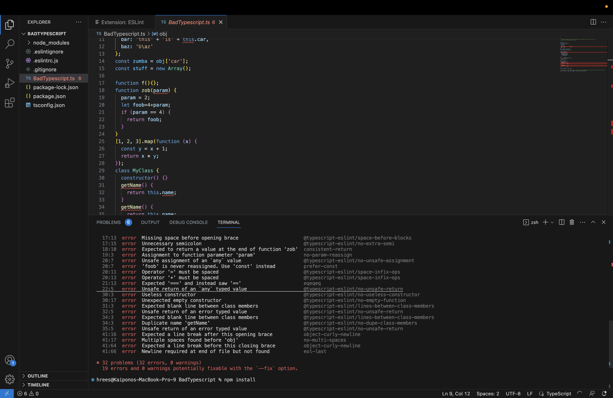
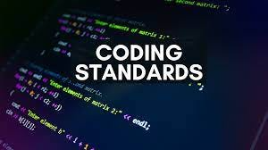

## Coding Standards: ESLint and VSCode

When people inculding myself when I first started seeing the phrase “coding standards,” they usually only think about small formatting rules, like how many spaces to use for indentation, where to place curly braces, or how they structure their code. Although these details most of the time feel unimportant because they do not affect what a program is doing. But after this past week and a half working with ESLint and TypeScript, I realized that coding standards do so much more than just making the code look clean. It can improve readability, identify mistakes, and teach newer programmers how to use and format a programming language more effectively.

## Setting Up My Coding Environment

Before I could actually utilize ESLint errors in VS Code, I first had to ensure that I set up my coding environment correctly. This was one of the most frustrating parts of E25: Fix bad TypeScript assignment because of the configuration files that needed to be downloaded and renamed correctly for the environment to work.

The files included:

sample.eslintrc.js, renamed to .eslintrc.js
sample.eslintignore, renamed to .eslintignore
sample.gitignore, renamed to .gitignore
sample.package.json, renamed to package.json
sample.tsconfig.json, renamed to tsconfig.json

At first, downloading these files seemed like an easy part of the assignment because I thought I only needed to add them to my project before writing code. However, I became confused when I had to rename them because some of the new filenames started with a period. On my Mac, files beginning with a period are treated as hidden files, so they appeared to disappear after I moved them to my Desktop. This stumped me for a while because I did not know where the files had gone or how to add them to my BadTypescript project folder. Once I figured out how to locate the hidden files and move them into the correct folder, I was able to continue setting up the project. This experience was different from what I was used to in my other classes, but I eventually learned that each configuration file had a specific reason for adding and renaming them.

The .eslintrc.js file held the ESLint rules and coding standards that the project follows. The .eslintignore file tells ESLint which files and folders it should not check. The .gitignore file prevents unnecessary files, such as the node_modules folder, from being added to GitHub. The package.json file lists the project’s packages and commands, including the command used to run ESLint. The tsconfig.json file tells TypeScript how to check and compile the project. Lastly, the index.html file was used to configure my code to JavaScript so I would be able to use the live preview to inspect the page and see if my code worked.

Although setting up the coding environment was frustrating, it helped me understand how configuration files and development tools work together. Finding the hidden files and placing them in the correct folder also made me more comfortable troubleshooting problems in VS Code and on my Mac. I gained a better understanding that an issue may come from the setup of the coding environment rather than the code itself.

## My First Thoughts/Experience with ESLint

My first week and a half using ESLint with Visual Studio Code was both frustrating and helpful. After finally getting my ESLint to start working with npm install, I ran npm run lint produced an error saying that ESLint could not find the Airbnb configuration. The message also showed that ESLint was reading a configuration file from my Desktop instead of the project folder.

This was confusing because I had already installed the packages I thought I needed. I learned that installing a package does not automatically mean that ESLint will find the correct configuration. The configuration files must be located in the proper project folder, their names must be correct, and the required packages must be installed within the project.

I also experienced the same problem as other classmates, where the terminal reported 38 errors when I ran npm run lint, while the VS Code editor only displayed six, even when I did Command+Shift+P to open a new directory. This made the assignment harder because I expected every terminal error to appear as a red underline in the editor. I wanted to use those underlines to locate and correct each problem, but the terminal and editor were not giving me the same results. I tried restarting the ESLint server and checking the VS Code settings, but the errors did not appear correctly in the editor.

Once I updated my Mac and VS Code, then restarted it, ESLint started working correctly. I was finally able to see all of the errors and begin fixing them. Having 38 errors in such a small file seemed overwhelming at first, but many were caused by similar issues. Although the setup process was frustrating, it helped me understand how ESLint, VS Code, Node, and the project configuration files are connected.

Before this assignment, I mostly focused on writing the code itself. Now I understand that when a development tool does not work, the problem may be caused by the coding environment instead of the program. Troubleshooting these issues also made me more comfortable using the VS Code terminal, running commands such as npm install and npm run lint, and checking that I opened the correct project folder.

## Formatting is Just A Part of It

Some of the ESLint errors initially seemed overly strict. It identified missing spaces, unnecessary semicolons, inconsistent formatting, and a missing newline at the end of the file. Fixing these errors sometimes felt monotonous because the program could still run with these errors.

I started to start thinking that if the code worked, then small formatting details should not matter. But code is not written only for the computer. It is also written for other programmers and for the original programmer who may return to it several months later. Consistent formatting makes it easier to understand the structure of a program without wasting time trying to interpret another programmer’s personal coding style. When everyone follows the same standards, the code becomes much easier to read and collaborate on. 

## Troubleshooting Before Running the Code

ESLint also found problems that were more serious than formatting. For example, it warned me about reassigning a function parameter, using an unsafe any value, and failing to return a value on every possible path. These rules can prevent bugs rather than simply changing the appearance of the code. A missing space will probably not break a program, but an unexpected any value or inconsistent return behavior can create problems that are difficult to diagnose later.

Since ESLint reports both formatting and programming errors, it combines a style checker like Grammarly and an early warning system before running the code. It helps programmers find problems before the program is executed or submitted. Even though fixing all the errors can be annoying, it is better to find those problems early than to discover them later when the code becomes larger and more complicated. Also, this helps programmers write better code and fix bad coding habits before they become hard to change.

## Learning Through Coding Standards

I agree that coding standards can help someone learn a programming language. ESLint does not only say that something is wrong. It normally provides the name of the rule that was violated. Looking up that rule can explain why one approach is safer or more commonly used than another. For example, being told to use const instead of let teaches the programmer to avoid unnecessary reassignment. Being told to use === instead of == introduces the issue of JavaScript’s automatic type conversion. TypeScript-related ESLint rules also encourage programmers to use proper types instead of depending on any.

Each error can become a small lesson about the language. Instead of allowing me to continue using bad habits, ESLint forces me to slow down, examine my code, and understand why a different approach might be better. This can be frustrating while completing an assignment, but it can also help build better programming habits over time.

## My Thoughts

In conclusion, my first experience with ESLint has been both painful and useful. The configuration issues and the number of errors were frustrating, especially when the terminal and VS Code editor did not actually show what was going on. But getting into the habit of correcting the errors helped me produce cleaner and better-formatted TypeScript code.

More importantly, this experience changed how I view coding standards. They are not just rules or unnecessary errors about spaces and indentations. When used properly, coding standards improve communication, prevent common mistakes, and help programmers develop better habits while learning a language. Fixing each error takes time, but each correction makes the program more consistent and teaches me something useful for future assignments.

## AI Use

Used Grammarly to check over my spelling, format, and grammar to ensure I write a cohesive and easy to read essay. 
