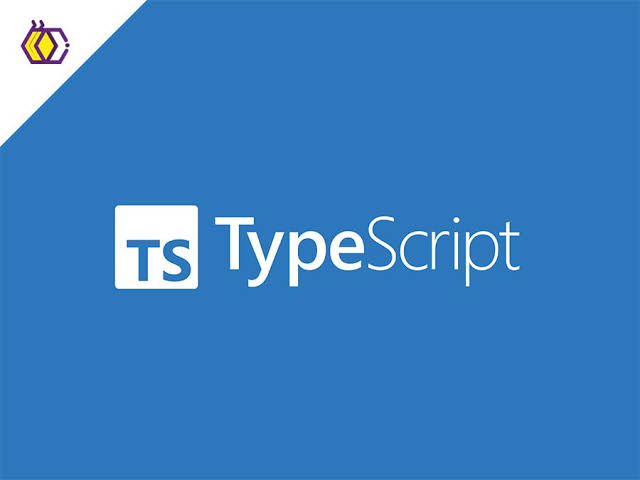

*Getting comfortable with TypeScript*

First, we have to define what comfort is, which is a state where something begins to feel easier and more natural over time.

When I first started this class and module, TypeScript felt pretty comfortable to me because of how similar it is to JavaScript. I already had experience working with JavaScript, so a lot of the different sentence structures and ideas were sort of familiar. But at the same time, this familiarity was also one of my biggest challenges. When you get comfortable writing your code a certain way, switching to something slightly different made it harder than I expected when I first started doing assignments. I would sometimes fall back into the coding habits I had with JavaScript instead of the different coding way that TypeScript needed me to do to work.

As I continued through the module, TypeScript started to make a lot more sense. The differences that made it annoying or confusing at first started to become easier for me to start getting into the flow of how I coded with JavaScript.

## Getting Used to TypeScript

The biggest difference I noticed with TypeScript was having to think more about the type of data I was going to be working with. In JavaScript, I could just create a variable and not have to worry too much about what type it was. But TypeScript makes me have to think twice and be more specific when putting a type on different variables. For example, throughout the Jamba Juice assignments, I created properties such as:

name: string;
ingredients: string[];
price: number;

At first, making sure to specify these types felt like another extra step that I had to remember when using different types. However, once I got more comfortable with it, I started to see the benefit of having types because they helped me catch mistakes earlier and made my code easier to understand and organize. If I accidentally tried to use the wrong kind of value somewhere, TypeScript would catch the problem before I even ran the code.

I also became more comfortable working with classes and objects during this module. The Jamba Juice assignments were really helpful because each assignment built on the previous one. I started with menu items and eventually had to make classes for drinks, orders, inventory, and stores. Instead of everything being one large piece of code, each class had its own responsibility for the different assignments. Seeing those pieces connect helped me understand why object-oriented programming can be useful.

## TypeScript and Software Engineering

From a software engineering perspective, I believe that TypeScript is a really good programming language because TypeScript adds more rules during coding, but those rules can make a program easier to understand and maintain.

Like this one thing I started noticing during the Jamba Juice assignments was how useful types become as programs get larger. If I have a method like:

orderDrink(drink: Drink): void

I immediately know what the method expects. So I don't have to guess what kind of information should be passed into it. This might not seem like that important when working on a smaller assignment like the first assignments, but I can see how it becomes much more useful when working on a larger project with other people.

TypeScript has made me realize that writing code is not just about getting the program to work, but building those good habits that make my code cleaner, more organized, and easier to understand in the future.

## Athletic Software Engineering

The athletic software engineering approach has probably been a very interesting part of this module. The practice WODs can definitely be stressful because there is a timer running while I am trying to solve a problem, and trying to make sure to finish under the time that I estimated can be hard. Usually, if I get stuck while programming, I can stop for a while and think about the problem. But during a WOD, I have to figure things out while also being aware of how much time I have left to finish the assignment.

I think that pressure has been useful for me to really get in the zone and get the assignment done before my estimated time. Doing similar problems has made certain parts of programming feel more natural. Instead of spending a long time trying to remember basic syntax, I am starting to recognize what I need to do much faster after every assignment. For example, in each Jamba Juice assignment, I had to make sure to create a class, establish my variables, and then make a constructor to take those variables.

Example:

I have already noticed this in my WOD times. On some assignments, I have been able to finish under my estimated time. Even when I go under, I can usually identify what slowed me down. That gives me something specific to improve before attempting another problem.

## Learning Through Practice

I think this style of learning has been a mix of stressful and enjoyable because the timed WODs put more pressure on me to solve problems quickly, but they also helped me to become more comfortable with my coding. At first, I was mainly focused on finishing before the time ran out, which added that level of stress. 

But as I got more practice, I started to enjoy seeing myself pick up things and finish problems faster. I also believe that this style of learning worked well for me because the multiple repetitions helped me build my confidence, thus making the concepts come more naturally when doing assignments and quizzes.

## Moving Forward

I have really liked learning TypeScript. The switch from JavaScript was challenging at first because I was comfortable with JavaScript, but once I got the hang of TypeScript, I felt increasingly confident when coding it. I especially like that TypeScript forces me to care about the details of the data in my programs.

In conclusion, my biggest takeaway from this module was that getting comfortable with a programming language does not mean that everything will be easy when you first start. It takes time, practice, and repetition to understand how everything comes together. TypeScript was challenging, but as I continued practicing, the concepts started to become more natural and comfortable.

## AI Use

Used Grammarly to check over my spelling, format, and grammar to ensure I write a cohesive and easy to read essay. 
