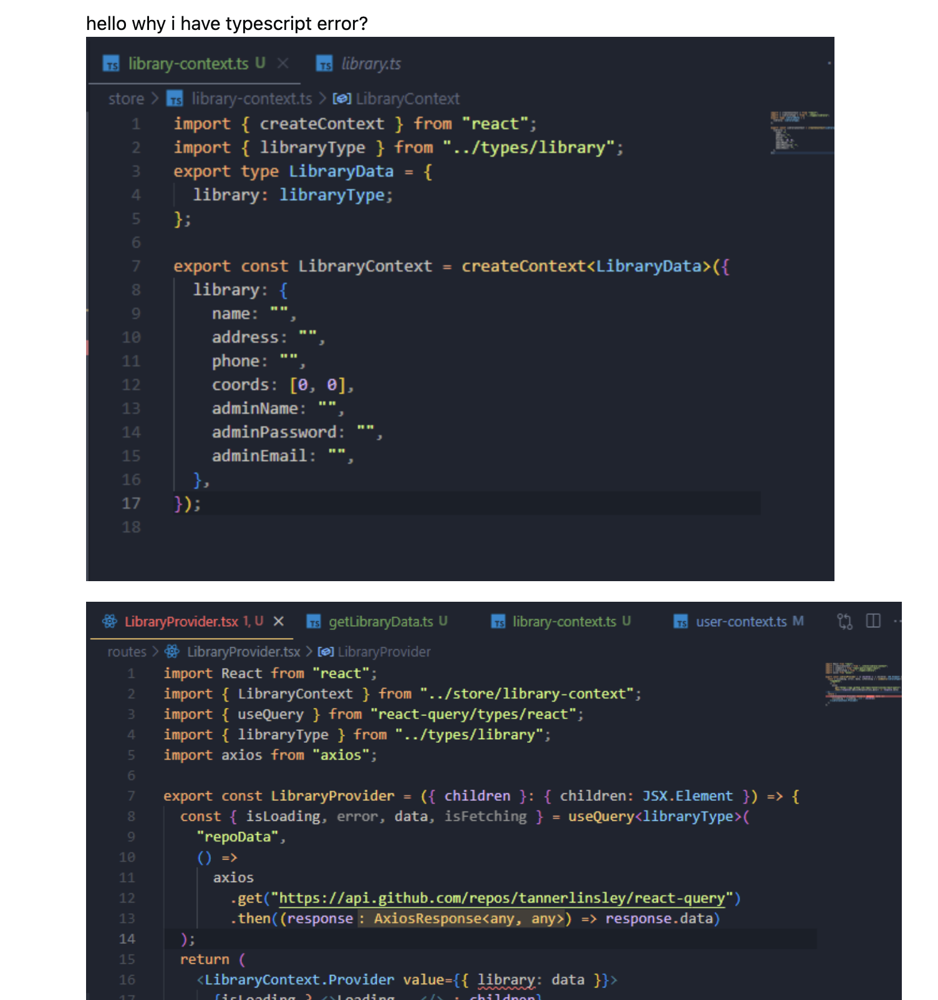

## Questions That Will Get Answers

When learning how to program or during programming, getting stuck on a problem is bound to happen. There are going to be a lot of times when I’m not going to be able to figure out why my code is not working or why a different programming language is giving me errors I didn't expect. That's where asking someone else for help can be a really helpful way to solve the problem that I'm stuck on, but the key is how I ask that question is where a lot of people mess up on. After reading Eric Raymond’s [How to Ask Questions the Smart Way](http://www.catb.org/esr/faqs/smart-questions.html), I learned that asking a good question requires more than just saying that something does not work or how do I fix this. A smart question should show that I have already put effort into solving the problem while also giving someone enough information to understand what I am struggling with.

## What Makes a Question Smart?

[StackOverflow](https://stackoverflow.com/questions) is a useful resource for programmers like myself because developers can ask questions and receive help from others in the programming community. The only problem with this is that the people answering these questions do not need to help. Thus, Eric Raymond explains that we should respect their time by researching the problem first and clearly explaining the problem you need help with.

A good question should explain what you are trying to accomplish, the relevant code behind it, show the error, errors, or unexpected result, and explain what you did to try and fix it. This should be specific enough that someone does not have to guess what the problem is.

## A Question Asked the Smart Way

The question I chose was "[Why does typing the return value of my function make the return value typed unknown?](https://stackoverflow.com/questions/79976653/why-does-typing-the-return-value-of-my-function-make-the-return-value-typed-unkn)" The developer was working with TypeScript and had an asynchronous function that was supposed to return a Promise<TeamType[]>. However, the function called another function named httpRequest, and TypeScript treated the value returned from that function as unknown. This caused an error because an unknown value could not automatically be returned as a TeamType[].

Question that was asked:

What made this a smart question was that the developer did not simply say, “My TypeScript code doesn't work.” They provided the relevant code, showed the error TypeScript was giving them, and explained what they had already tried. They discovered that using as TeamType[] made the error disappear, but instead of stopping there, they wanted to understand why TypeScript required them to do that.

This follows Raymond’s guidelines because it shows that the developer had already put effort into solving and understanding the problem. The question also gave other developers enough information to figure out what was happening without having to ask a bunch of follow-up questions.

The responses show why asking a smart question can lead to better help. One answer explained that the httpRequest function was using a generic type, but TypeScript did not have enough information to determine what that type should be. Because of this, the returned value became unknown. The answer showed that the developer could specify the type when calling the function, such as httpRequest<TeamType[]>(). The response did more than just provide working code because it explained why the problem was happening.

Answer to the Question:

The developer received an answer and confirmed that the solution helped them understand the problem. I think this is a good example of what Raymond means by asking questions the smart way. Since the question was clear, concise, and included the necessary information, the people answering focused on solving and explaining the actual problem instead of trying to figure out what the developer was trying to ask.

## How Not to Ask for Help

A not-so-smart question I found on Stack Overflow was [“ReactQuery + Typescript how to type query.”](https://stackoverflow.com/questions/75262215/reactquery-typescript-how-to-type-query) The developer was having a problem with TypeScript while using React Query, but they provided little to no explanation about what was actually going wrong. Their main description was "hello why i have typescript error?." They did not clearly explain what they expected the code to do, how they thought it should work, or what they did to try to fix the problem. They just asked a very poorly written question with pictures of their code, no background, no nothing, which is probably the reason why no one responded to this question.

Poorly Written Question:

This example doesn't follow any of the rules of Raymond’s recommendations because the developer didn't make it easy for others viewing the problem to understand it. Although some of the code was provided, there was no explanation to show that they even tried to research the issue or tried different solutions before asking for help. Someone trying to answer this question had to figure out everything the developer was trying to fix instead of being able to focus directly on the problem. Also, the pictures of the code only tell one story. If there is no explanation of the code, how are they supposed to give you what you're looking for? That's exactly what this developer did.

The responses to this problem also show how asking a question this way can make getting help not effective at all. Someone was still able to provide a solution, but they had to make assumptions about what the developer was trying to do. This could have been avoided if the developer had included the exact problem, what they expected to happen, and what they had already tried.

## My Takeaways

Comparing these two good and bad types of questions helped me understand that asking a smart question is a skill that people should learn. Before asking someone for help, I should ensure I first research the problem and try different solutions myself. Even if I cannot figure it out, doing that research and taking notes on it gives me more information/explanation that I can include when I post or ask my question.

I also learned that simply saying “my code doesn’t work” or “hello why i have typescript error?” is not enough for someone to fully help me. I should make their job as easy as possible, to the point where all they have to do is read and look at the code for a little bit to understand what is needed. This includes adding my exact code, the exact error, what I want to happen, what I got, and what I have already tried, which helps give someone a much better starting point when viewing the problem.

The good TypeScript question also showed me that a smart question doesn't just help someone find the solution. It can also better help them understand why the solution works. The developer had already found a way to fix their error by using TeamType[], but they still wanted to know the why behind it. Which lead to them understanding and learning more about TypeScript generics instead of simply copying a solution and moving on.

## Conclusion

In conclusion, this lesson showed me that communication is a key component in software engineering as knowing how to write code. There will always be problems that I will not be able to solve on my own, so knowing how to ask questions and conveying the question you want answered is something that I will need throughout my coding career. Also, asking a smart question means respecting the time of the person or people helping me while also giving myself the best chance of receiving a complete answer.

Throughout this semester, I want to ensure that I research the problem that I'm stuck on first, explain exactly what I am having trouble with, and include the necessary information needed to understand the problem I'm asking.

## AI Use

Used Grammarly to check my spelling, format, and grammar to ensure I write a cohesive and easy-to-read essay. Also, I used ChatGPT to ensure that my paragraphs were formatted correctly.
