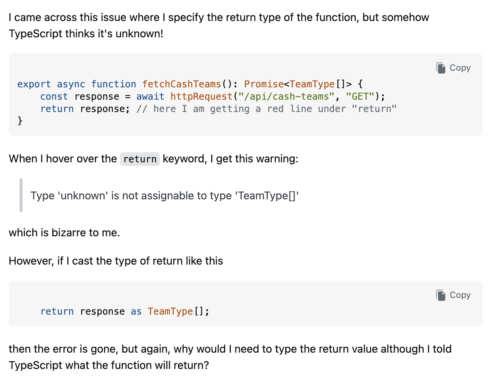
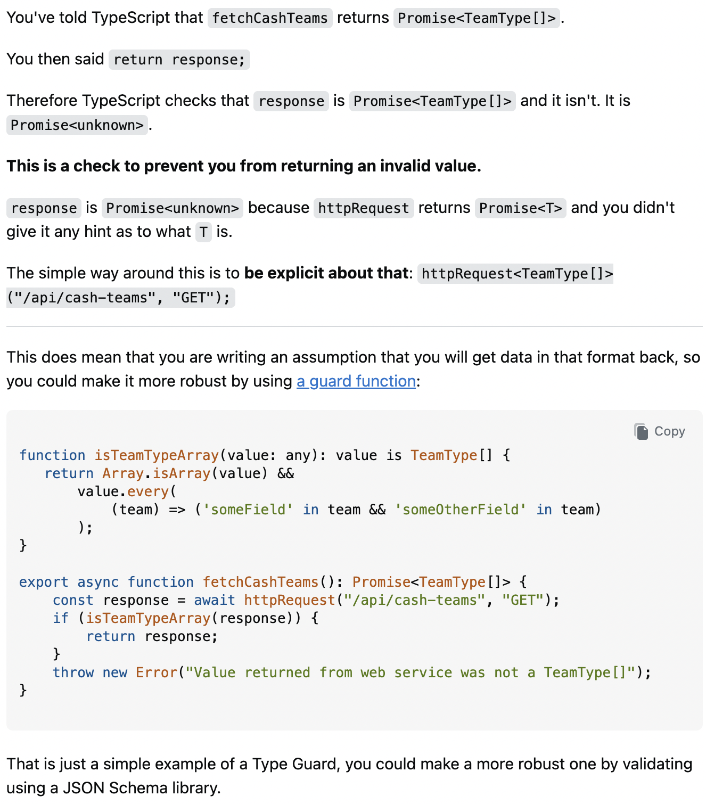

## Questions That Will Get Answers

When learning how to program or during programming, getting stuck on a problem is bound to happen. There are going to be a lot of times when I’m not going to be able to figure out why my code is not working or why a different programming language is giving me errors I didn't expect. That's where asking someone else for help can be a really helpful way to solve the problem that I'm stuck on, but the key is how I ask that question is where a lot of people mess up on. After reading Eric Raymond’s [How to Ask Questions the Smart Way](http://www.catb.org/esr/faqs/smart-questions.html), I learned that asking a good question requires more than just saying that something does not work or how do I fix this. A smart question should show that I have already put effort into solving the problem while also giving someone enough information to understand what I am struggling with.

## What Makes a Question Smart?

[StackOverflow](https://stackoverflow.com/questions) is a useful resource for programmers like myself because developers can ask questions and receive help from others in the programming community. The only problem with this is that the people answering these questions do not need to help. Thus, Eric Raymond explains that we should respect their time by researching the problem first and clearly explaining the problem you need help with.

A good question should explain what you are trying to accomplish, the relevant code behind it, show the error, errors, or unexpected result, and explain what you did to try and fix it. This should be specific enough that someone does not have to guess what the problem is.

## A Question Asked the Smart Way

The question I chose was "[Why does typing the return value of my function make the return value typed unknown?](https://stackoverflow.com/questions/79976653/why-does-typing-the-return-value-of-my-function-make-the-return-value-typed-unkn)" The developer was working with TypeScript and had an asynchronous function that was supposed to return a Promise<TeamType[]>. However, the function called another function named httpRequest, and TypeScript treated the value returned from that function as unknown. This caused an error because an unknown value could not automatically be returned as a TeamType[].

Question that was asked:

What made this a smart question was that the developer did not simply say, “My TypeScript code doesn't work.” They provided the relevant code, showed the error TypeScript was giving them, and explained what they had already tried. They discovered that using as TeamType[] made the error disappear, but instead of stopping there, they wanted to understand why TypeScript required them to do that.

This follows Raymond’s guidelines because it shows that the developer had already put effort into solving and understanding the problem. The question also gave other developers enough information to figure out what was happening without having to ask a bunch of follow-up questions.

The responses show why asking a smart question can lead to better help. One answer explained that the httpRequest function was using a generic type, but TypeScript did not have enough information to determine what that type should be. Because of this, the returned value became unknown. The answer showed that the developer could specify the type when calling the function, such as httpRequest<TeamType[]>(). The response did more than just provide working code because it explained why the problem was happening.

Answer to the Question:

The developer received an answer and confirmed that the solution helped them understand the problem. I think this is a good example of what Raymond means by asking questions the smart way. Since the question was clear, concise, and included the necessary information, the people answering focused on solving and explaining the actual problem instead of trying to figure out what the developer was trying to ask.

## How Not to Ask for Help

A not-so-smart question I found on Stack Overflow was [“ReactQuery + Typescript how to type query.”](https://stackoverflow.com/questions/75262215/reactquery-typescript-how-to-type-query) The developer was having a problem with TypeScript while using React Query, but they provided little to no explanation about what was actually going wrong. Their main description was "hello why i have typescript error?." They did not clearly explain what they expected the code to do, how they thought it should work, or what they did to try to fix the problem. They just asked a very poorly written question with pictures of their code, no background, no nothing, which is probably the reason why no one responded to this question.

Poorly Written Question:

## Conclusion

When we rely on others’ generosity and expertise to provide answers to our questions, it should hold that the question we ask should be one that leads to efficient and effective help that not only benefits us, but also the people we ask and others who might ask the same question in the future. Thus, if you have a question… make it a smart one! Asking questions may not always get you the best answer, but asking them in a way that will make others want to answer them will increase the success of finding a good solution and make it a positive experience on all sides.
