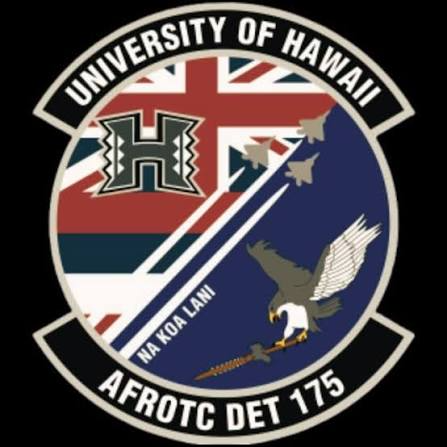

Throughout my college career, two of my biggest interests have been Computer Science and being a pilot in the Air Force. At first, I viewed these as two separate parts of my life, with Computer Science being what I study academically and piloting being the career I hope to pursue in the Air Force. However, as I have gained more experience in both ICS and AFROTC, I have started to realize how much the two can connect with each other.

ICS has taught me how to approach problems logically and find solutions when something does not work the way I expect it to. At the same time, AFROTC has challenged me to become a better leader, communicator, and teammate with my team and the cadets under me as well. Both require me to solve complex problems, work with others, and continue to learn from my mistakes. Moving forward, I hope to continue growing in both of myself and eventually use the skills I gain from each throughout my career.

## My Interest in Software Engineering

One of the things that interests me most about software engineering is how much problem-solving is involved when facing certain problems. I like being given a problem and having to figure out how I can use code to produce a solution that solves the problem. Sometimes that process can be really frustrating, especially when I cannot figure out why my code is giving errors or is not working, but when I finally get my program to work, it makes the struggle worth it and makes me feel more accomplished.

My ICS classes have also shown me that software engineering is about much more than just knowing how to code. I have been learning how important teamwork, organization, and being able to understand other people's code are. As I continue through this program, I want to become more confident working on larger projects where I have to combine past skills learned in ICS instead of only focusing on smaller individual assignments.

## My Future in the Air Force

The Air Force is another major part of what I hope to do in the future and for my career. Through AFROTC, I have already had many opportunities to experience and practice leadership and learn what it means to be responsible for people under me than just myself. Being placed in leadership positions has challenged me to communicate clearly, manage my time, hold myself and others accountable, and make decisions when cadets are depending on me.

These are skills that I want to continue developing because I know becoming a good officer will take more than simply knowing how to do a task. I want to become someone who can understand a problem, make a decision, communicate a plan, and help the people around me succeed instead of just fixing a problem. I also want to gain more experience by working with different types of people because everyone communicates, learns, and responds to leadership differently.

## Combining the Two

## Skills I Want to Build

## Looking Toward the Future

Since I have already received a pilot slot in the Air Force, I have a clearer idea of where my career is headed. Right now, my main goal is to take advantage of my experiences in ICS and AFROTC to continue developing both my technical and leadership skills, which I hope to carry with me throughout my career as an Air Force pilot.

In conclusion, I hope to leave college with more than just a degree. I want to take the problem-solving, communication, and leadership skills I have developed through both ICS and AFROTC and apply them throughout my career. As I prepare to become an Air Force pilot, I believe the experiences I have gained from ICS will help me approach challenges with a different perspective and become a more effective leader and officer.
