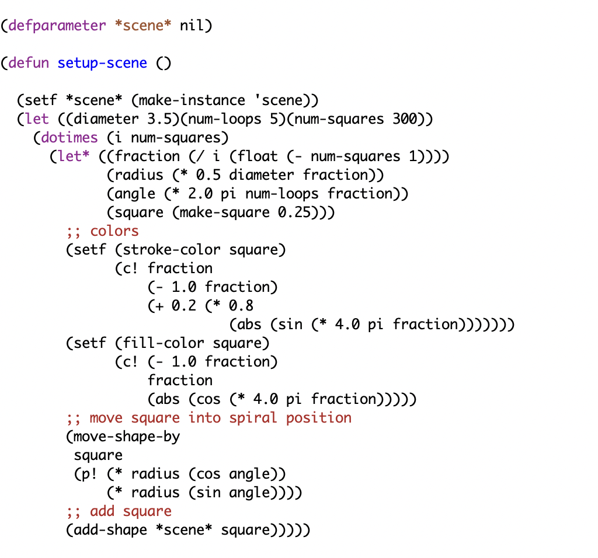

  

## Summary

For the first scene, I created a spiral design made up of 300 individual squares. The goal of the assignment was to use the shape functions we created in Common Lisp and OpenGL to build a more complex image. I used a diameter of 3.5 and five loops to control the overall size and shape of the spiral.

To create the spiral effect, I calculated a different radius and angle for every square. As the program moves through the 300 squares, the radius gradually increases, causing the squares to move farther away from the center. I then used cos and sin with the calculated angle to determine the x and y positions of each square. This is what creates the circular pattern that expands outward into a spiral.

I also wanted the scene to be more visually interesting, so I gave the squares different fill and stroke colors as they moved through the spiral. The colors change based on each square's position using the fraction variable along with sin and cos. Overall, this scene helped me better understand how I could combine loops, mathematical calculations, colors, and the shape functions we created to produce a larger and more interesting design.
