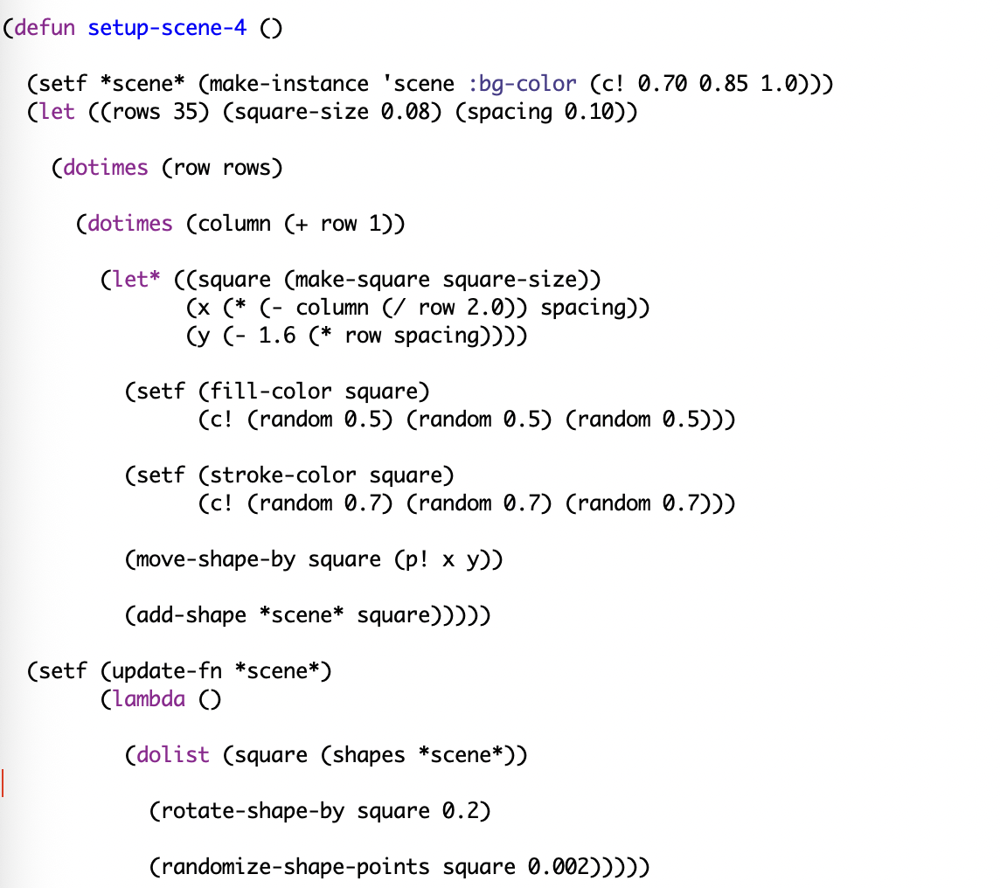

## My Thoughts on the Assignment

For this part of the assignment, I thought it was interesting to learn how animation can be added to a scene instead of only displaying shapes that stay still. I liked seeing how small changes to the squares every frame could make the entire pattern look like it was moving and changing. It also helped me better understand how the update function works and how it continuously changes the shapes while the program is running. I enjoyed experimenting with different rotation and randomization values because even a small change could make the animation look completely different. This part of the assignment also showed me how movement, color, and shape patterns can all work together to make a scene feel more creative and interactive.

## What I Did

I created a large pattern using 35 rows of small squares on a baby blue background. Each square was given a random darker fill color and a random outline color, which made every square look slightly different from the others. I then used an update-fn to animate the scene by slightly rotating each square and randomly changing the positions of its points to create a cool distortion effect. As the update function continued to run, the squares gradually changed from their original shapes and made the overall pattern look like it was constantly moving. I experimented with different rotation speeds and randomization values to find a balance where the movement was noticeable without changing the squares too quickly. This allowed me to combine the shape, color, movement, and animation functions that I created throughout the assignment into one scene.

## Problems and Challenges

One of the biggest challenges was getting the animation to work correctly. At first, I had the shapes created correctly, but I had to figure out how to make the update-fn run while the OpenGL window was running. I also had to experiment with the rotation and randomization values because larger values caused the squares to move and distort too quickly.

<video width="1000" controls>
  <source src="../videos/lispAnimation.mp4" type="video/mp4">
  Your browser does not support the video.
</video>

## What I Would Do Differently

If I did this again, I would spend more time planning what I wanted the final animation to look like before writing the code. I would also experiment with different types of movement instead of mainly rotating and randomizing the points of the squares. This could make the animation look smoother and more controlled.

## What I Would Do With More Time

If I had more time, I would make the animation more interactive. I would add keyboard controls so that holding or pressing different keys could make the squares rotate, change colors, move into different patterns, or return to their original positions. I would also try making the squares transform between different designs instead of continuously changing in the same way.
